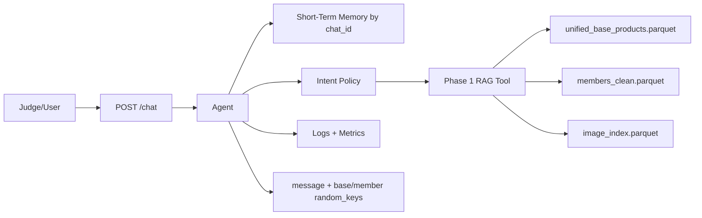

# Architecture

```mermaid
flowchart LR
  User["Judge/User"] --> API["POST /chat"]
  API --> Agent["Agent"]
  Agent --> Memory["Short-Term Memory by chat_id"]
  Agent --> Policy["Intent Policy"]
  Policy --> Tool["Phase 1 RAG Tool"]
  Tool --> Base["unified_base_products.parquet"]
  Tool --> Members["members_clean.parquet"]
  Tool --> Image["image_index.parquet"]
  Agent --> Logs["Logs + Metrics"]
  Agent --> Response["message + base/member random_keys"]
```

The design is intentionally small. The RAG tool is the only place that touches Phase 1 artifacts; the Agent only decides which tool action is needed and formats the final response.
